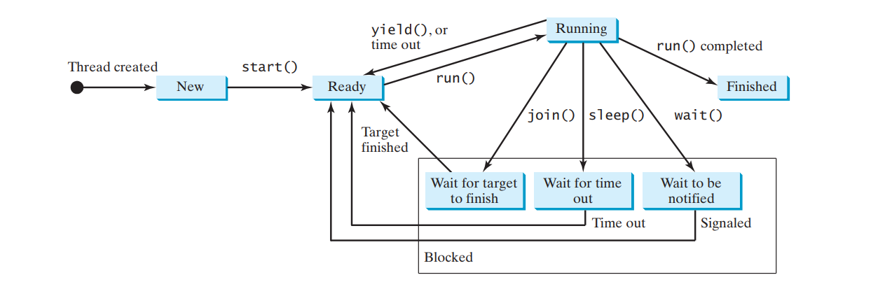
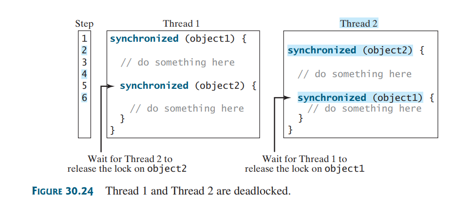

# java-multi-threading
playground for learning multi-threading in java 

## thread states diagram

## Deadlock example diagram

## synchronized collection
The classes in the Java Collections Framework are not thread-safe; that is, their contents may
become corrupted if they are accessed and updated concurrently by multiple threads. You can
protect the data in a collection by locking the collection or by using synchronized collections.
The Collections class provides six static methods

